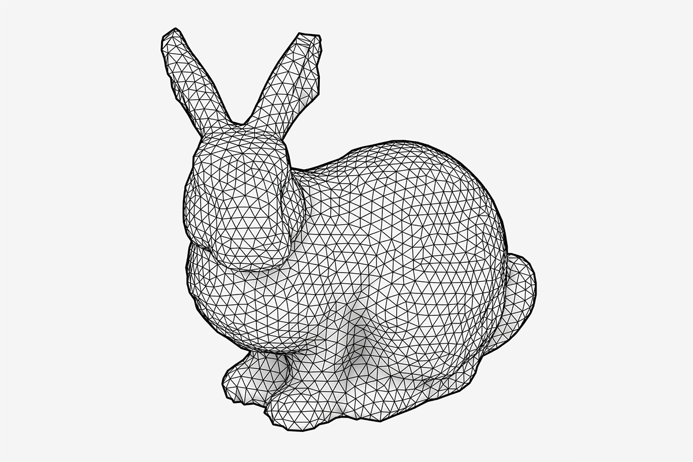
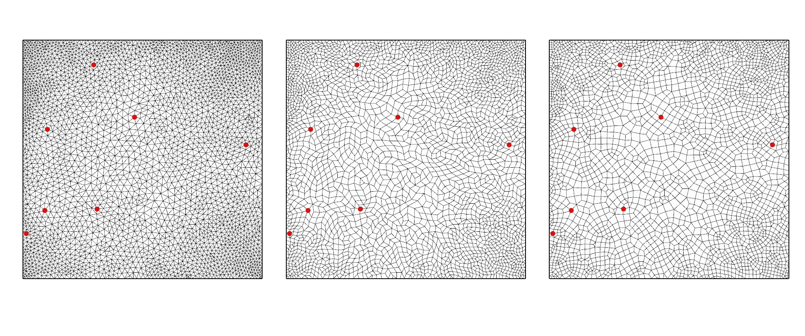

# Mesh Quadrangulation

### Overview

> **Warning**
> 
> This repo is still very much work in progress.

A set of grasshopper components to quadrangulate tri-meshes by merging faces using a graph-matching approach.

This stems from the need to get quad based meshes for FE-analysis. Many good tools exist to do smooth adaptable triangulations in gh but few
offer "sofistik" style FE-suitable meshes. This can be done through the process of *Triangulation -> Quadrangulation -> Smoothing*.

The process works as follows. Given a quality triangulated mesh (in this case provided using the remeshing in [this toolkit](https://github.com/joelhi/g3-gh)), the quadrangulation works by constructing a graph for the face connectivity, and walking this graph according to a *breadth-first* or *depth-first* search, finding a set of [**matchings**](https://en.wikipedia.org/wiki/Matching_(graph_theory)), pairs of triangles that can be merged into quads.

An example of the process is shown below.

To generate a quadrangulated FE mesh, create a triangulation, and do a quadrangulation, followed by a smooth. Make sure to fix the nodes used for supports or edges in the smoothing process. An example file can be found in the *example* folder which shows the following geometry.

Left is the triangular mesh, middle the quadrangulated and right the smooth quad-mesh. The red points are pinned during the process.

This is quite work in progress still, and may be extended to feature more graph based mesh processing algorithms in the future; beyond what's needed for quadrangulation.

### Contents

The repo has two projects. 

- **MeshGraphLib**
- **MeshQuadrangulationGH**

The first one features a graph data structure and the processing algorithms, along with some conversion helpers to and from Rhino geometry.

The second is the gh-plugin, which for now only has two component: *Quadrangulate Meshes* and *Laplacian Smooth*

### Todo

- [x] Base graph structure
- [x] Quadrangulation algorithm
- [x] Laplacian smoothing (with option to fix points)
- [ ] Handle loops (faces) in graph structure
- [ ] Catmull-Clark algorithm (with option to fix points) for smoothing
- [ ] Handle non-convex matching cases.
- [ ] Expose explicit steps in process as gh components
- [ ] Implement [Blossom algorithm](https://en.wikipedia.org/wiki/Blossom_algorithm) for computing matchings.
